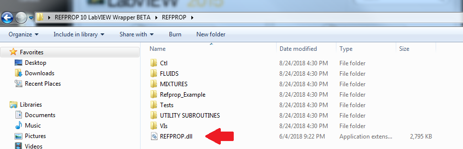

# Labview Wrapper

Thank you for downloading the REFPROP 10 LabVIEW wrapper 1.0! Here are a few tips to get you started.

## Getting Help

For assistance with the Labview wrapper, please open an issue on github: https://github.com/usnistgov/REFPROP-wrappers/issues/new

## Installation

[Download a zip file of this repository](https://github.com/usnistgov/REFPROP-wrappers/archive/master.zip), then navigate to the wrappers/Labview folder

## Testing

You will find a small test project called "“"REFPROP High Level API Tester" that can be used to validate the new high-level API functions. That project includes several tests that are designed to work independently and that demonstrate a few different ways to initialize the various components of the new API.

You will also find a complete list of the lower level REFPROP functions along with a test program called "Refprop_Example_main.vi" that demonstrates much of the functionality of the low-level API.
Before this wrapper will work, you will need to add a copy of the REFPROP.dll for version 10, 32 bits to the REFPROP folder. You will also need to copy the FLUIDS and MIXTURES files form your copy of REFPROP into the empty folders in the wrapper’s directory. 
    
 

If you want to add the REFPROP wrapper to your LabVIEW palettes, you can add the entire REFPROP folder along with the dll to the user.lib folder for your version of LabVIEW.
This wrapper was written in LabVIEW 2015, and it should be compatible with all newer versions of LabVIEW.