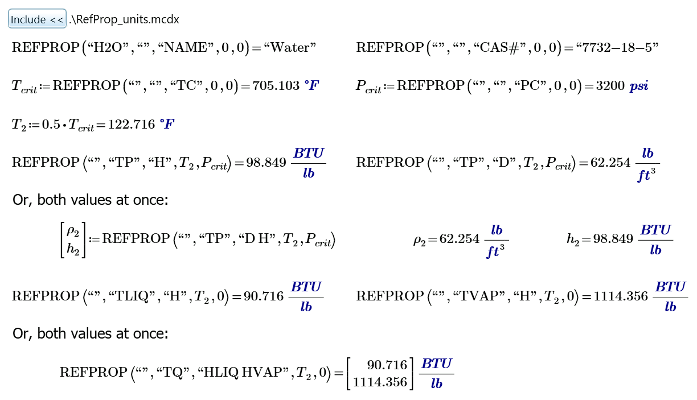

# High-Level API Calls

The High-Level API calls were introduced in NIST REFPROP 10 and wrappers for this functions are introduced in the RefProp Mathcad Add-in version 2.1.  The following High-Level API functions are implemented (in alphabetical order).

* **rp_ERRMSG(0)** - Retrieves full error messages from NIST REFPROP for the last function call
* **rp_FLAGS(_hFlag_, _jFlag_)** - Set (and get) flags that modify NIST REFPROP behavior
* **rp_GETENUM(_iFlag_, _hEnum_)** - Get enumerated values for various REFPROP inputs
* **rp_REFPROP(_hFld_, _hIn_, _hOut_, _a_, _b_)** - General REFPROP() call; returns an array of numeric values
* **rp_REFPROP1(_hIn_, _hOut_, _a_, _b_)** - Shortened REFPROP() call; returns single scalar values
* **rp_REFPROPc(_hFld_, _hIn_, _hOut_, _a_, _b_)** - Special REFPROP() call for returning character data 
* **rp_SETFLUIDS(_hFld_)** - Loads specified pure fluid(s) from the REFPROP library
* **rp_SETMIXTURE(_hMixNme_)** - Loads pre-defined mixtures from the REFPROP library, returning composition.
* **rp_SETPATH(_hPath_)** - Sets the path to an alternate location for the fluid/mixture files

## REFPROP()

The REFPROP function was created in the High-Level API to provide a single function through which all properties and fluid/mixture information could be retrieved.  It is the Swiss Army knife of the NIST REFPROP library.  In addition, various flags are available that can be sent to this routine to gain access to all other features and settings of the REFPROP program.  For full documentation of its use, one should consult the [NIST REFPROP DLL Documentation](https://refprop-docs.readthedocs.io/en/latest/DLL/index.html).

Because of the limitation of Mathcad Custom Functions to return only one data type, the calls to the REFPROP functions has been broken up into three add-in functions:

1. **rp_REFPROP()** - Standard call that can only return (and always returns) numeric values in a numeric array.  This form always requires a fluid string as the first parameter (as does the underlying REFPROP() function).  However, if called more than once with the same fluid string, it will be ignored on multiple calls.   If empty (""), the previously loaded fluid will be used as well.  

2. **rp_REFPROP1()** - The same as rp_REFPROP, except that only one single numeric value can be requested at a time and the previously loaded fluid is always used, so the fluid string is not passed as a parameter.

3. **rp_REFPROPc()** - The same as rp_REFPROP, except that only a single character string can be returned.  Requires a fluid string, but it can be blank to use previously loaded fluid.

All three rp_REFPROP function variations require the following input parameters:
- **_hIn_** - Single string containing the property codes to identify the state-point pair of variables passed in _a_ and _b_.  May be an empty string ("") for state-point independent property requests.  (_See [NIST REFPROP DLL Documentation for REFPROPdll](https://refprop-docs.readthedocs.io/en/latest/DLL/high_level.html#f/_/REFPROPdll) for a full listing of valid codes_)
- **_hOut_** - Single delimited string containing the codes for the requested output properties. (_see [NIST REFPROP DLL Documentation for ALLPROPSdll](https://refprop-docs.readthedocs.io/en/latest/DLL/high_level.html#f/_/ALLPROPSdll) for a full listing of valid codes_) 
- **_a_** - First state-point value.  May be 0 or arbitrary if not required.
- **_b_** - Second state-point value. May be 0 or arbitrary if not required.

However, **rp_REFPROP()** and **rp_REFPROPc()** also require a fluid string, **_hFld_**, as the first parameter, before the others mentioned above.

Attempts have been made to greatly simplify these Mathcad Custom Functions as much as possible so that they require a maximum of four or five input parameters.  Simplifications include:
* Input/Output units are _always_ "MASS SI" with slight modification to Thermal Conductivity [W/m-K] and Surface Tension [N/m] for consistency with the Legacy API custom functions.  This can be changed with the proper calls, but it not recommended, since Mathcad can easily handle unit conversions natively and the special REFPROP() unit wrapper expects this system of units.
* Compositions are always input and output as mole fractions, since they can easily be converted to and from mass fractions in Mathcad when the molecular weights of the fluid/components are known.
* The mixture composition, _z_, is maintained and handled internally by the Custom Function DLL as fluids and mixtures are loaded.
* All other _output_ parameters are superfluous as they can be requested in _hOut_ and returned in the _Output_ array.  

Finally, while the above functions can be called with dimensionless parameters and output, a single user function, `REFPROP(hFld,hIn,hOut,a,b)`, is provided in the `Refprop_units.mcdx` include file that automatically makes the determination on which custom function to call, provides better error handling, and handles Mathcad units on the inputs and numeric output values.  The `Refprop_units.mcdx` include file can be located in the same location as the active Mathcad worksheet or in a convenient shared location. Here is a Mathcad example of using the High-Level function, `REFPROP(hFld,hIn,hOut,a,b)`, through the unit wrapper function.

## Utility Functions

The remaining implemented functions are utility functions that access the other features and settings of the NIST REFPROP library.  They are provided for advanced use of the NIST REFPROP code and nearly exactly mirror the behavior of the underlying DLL public functions.  The NIST REFPROP DLL Documentation should be consulted for their use.

## Other Considerations

Consideration was given to implementation of the `ALLPROPSdll` function and its variations in the High-Level API.  However, it is not implemented as there are no advantages to using it over the `REFPROP()` function, which provides greater functionality, handles both single and two-phase states, and is not limited to Temperature and Density (TD) state point specification.  The `ALLPROPS0dll` function may provide some performance benefits (does not use any string manipulation), but it is still limited to single-phase, temperature-density state points, fixed default units, and it is provided as a "beta features" until a determination is made that any performance benefits are not consumed in providing pre and post-processing of inputs and results in Mathcad itself.

Additional consideration was given to implementation of the `ABFLSHdll` function for providing generic flash calculations in the two-phase region.  However, this functionality is provided through the REFPROP() functions and, in fact, the underlying `REFPROP()` function code makes calls directly to `ABFLSH()` to make its phase determinations.  If computational speed is of the essence, the low-level [Legacy API](LegacyAPI.md) functions should be called, which are already implemented as Mathcad Custom Functions.

# Additional Help

For more information on how to use the REFPROP 10 High-Level API functions in Mathcad Prime, see [RefProp High-Level API Help](https://raw.githack.com/usnistgov/REFPROP-wrappers/master/wrappers/Mathcad/doc/HELP_EN/Refprop/RefpropHelp.htm) 