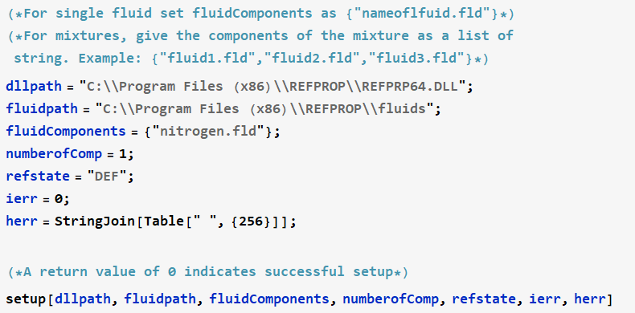
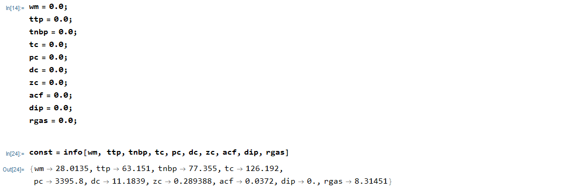
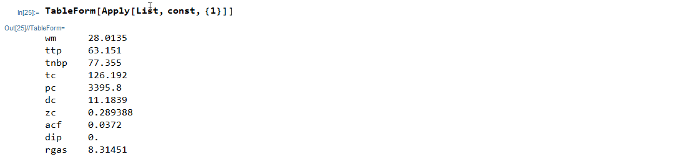

# Mathematica REFPROP Wrapper
Initial wrapper package created by Wolfram Research and provided here by NNL (P. Fourspring) with approval and permission from Wolfram Research.

This directory contains a Mathematica package, **RefpropLink** that provides a wrapper to **NIST RefProp**.  The user must have **NIST RefProp 9.0** or later installed locally on the machine with a working version of **Mathematica**

## Steps to install the RefpropLink package

1. Download (and unzip if necessary) this repository. 
 
2. Open Mathematica and evaluate the following
   ```
   SystemOpen[FileNameJoin[{$UserBaseDirectory, "Applications"}]]
   ```
   by pressing `<Shift>+<Enter>`. The above command will open up Windows explorer to the user's Applications folder. 
    
3. Copy the `RefpropLink` folder from this repository into the user's Applications folder.

The RefpropLink package is now installed and can be used from any Mathematica file.  This procedure does not have to be repeated, but should be performed by each user on the machine.

## Instructions File

One can open the file `RefpropLinkInstructions.wls` (a Wolfram language script), which walks through installation and usage of all the wrapper functions available.

## Loading RefpropLink from within Mathematica

In any Mathematica session or script, the **NIST RefProp** functions are loaded by evaluating (`<Shift>+<Enter>`) the following command.
   ```
   Needs["RefpropLink`"]
   ```
This command loads the RefpropLink context if it has not already been loaded.

## Setup

**Setup** calls the function `SETUPdll()` from the REFPROP64.DLL in the **NIST RefProp** installation directory and loads a fluid, mixture, or set of fluids from the `fluids\` or `mixtures\` sub-folders in the **NIST RefProp** installation directory.  Setup can be run in two ways:
1. Using a provided user interface, or
2. Programmatically.
Both methods are shown below.

### 1. The RFPI user interface function

   Evaluate the `RFPI[]` function.
   ```
   RFPI[]
   ```

   

   * The default paths of the installed `REFPROP64.DLL` and `fluids\` subfolder will be pre-populated, but can be changed if needed.  
   * For a single fluid, set the **number of components** to **1** and the **Input single fluid or mixture** field to `{fluidname.fld}`.  The example above uses this method to load the single pure-fluid file for `nitrogen`.
   * For mixtures, set the **Input single fluid or mixture** field as a list of comma separated strings.  For example: `{"fluid1.fld","fluid2.fld","fluid3.fld"}`.  Set the **Input number of components** fields to the appropriate number of fluids in the mixture.
   * The Reference state can be modified using the drop-down if needed.
   * Press the *Initialize* button.

### 2. Programmatically - define models and initialize arrays

   Set all parameters up as strings and pass them to the `setup[]` function with a direct call.

   

## Calling NIST RefProp Functions

Once setup is called to initialize the fluid, the **NIST RefProp** calls to the legacy API functions can be made by
1. setting up and initializing all of the input/output variables so that Mathematica has them defined in memory, and
2. making the wrapper function call with those variables.

Here is an example of a call to the `info` function for the fluid `nitrogen` as initialized in setup above.

   

Results can also be shown in table format:

   

The wrapped functions in the RefpropLink package are listed below.

* **setup** - setupdll will initialize the program
* **info** - provides fluid constants for specified component
* **satp** - Calculate saturation properties at a given p
* **tprho** - iterate for density as a function of temperature, pressure, and composition for a specified phase
* **tpflsh** - General flash subroutine 
* **therm** - compute thermal quantities as a function of temperature, density, and compositions using core functions (Helmholtz free energy, ideal gas heat capacity and various derivatives and integrals)
* **press** - compute pressure as a function of temperature, density, and composition using core functions
* **fgcty** - compute fugacity for each of the nc components of a mixture by numerical differentiation (using central differences) of the dimensionless residual Helmholtz energy
* **virb** - compute second acoustic virial coefficient as a function of temperature and composition
* **virc** - compute third acoustic virial coefficient as a function of temperature and composition
* **dpdd** - compute partial derivative of pressure w.r.t. density at constant temperature as a function of temperature, density, and composition
* **dpdd2** - compute second partial derivative of pressure w.r.t. density at const temperature as a function of temperature, density, and composition
* **dpdt** - compute partial derivative of pressure w.r.t. temperature at constant density as a function of temperature, density, and composition
* **dhdl** - Compute partial derivatives of enthalpy w.r.t. t, p, or rho at constant t, p, or rho as a function of temperature, density, and composition
* **surft** - Compute surface tension
* **trnprp** - Calculate viscosity (eta) and thermal conductivity (tcx)
* **tdflsh** - General property calculation with inputs of t,d,x
* **pdflsh** - General property calculation with inputs of p,h,x
* **meltt** - Calculate melting pressure
* **dielec** - Calculate dielectric constant
* **RFPI** - Brings up a an interface to run set up
* **checkErrorCodes** - Checks error codes during set up

For an example of the usage of each of these functions, load the `RefpropLinkInstructions.wls` file into Mathematica and evaluate the functions in the examples.


