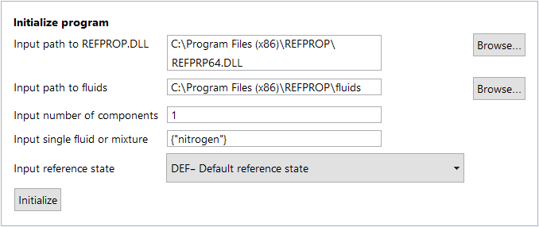

# Mathematica REFPROP Wrapper

Initial wrapper package was created by Wolfram Research under contract to the U.S. Naval Nuclear Laboratory (NNL). Wolfram Research and NNL agreed to provide the wrapper package to the REFPROP community. Patrick Fourspring facilitated the agreement and the transfer.<br>Jeff Henning facilitated the transfer of the wrapper package to NIST REFPROP-wrappers repository on GitHub.

## Overview

The Wolfram Language (WL) wrapper provide a diverse range of WL functions calling individual subroutines of the NIST RefProp functions in the REFPROP64 DLL.  The file `RefpropLinkInstructions.wls` is a Wolfram Language Script that provides the required installation steps and provides examples of calls to each of the WL wrapper functions.  Opening this file directly in Mathematica, the user can easily follow along with the steps to:

   - Install the package in the user's local Mathematica environment (only need to do once)
   - Initialize the `RefpropLink` package (at the beginning of any notebook/script)
   - Make calls to the different RefProp wrapper

This instructions file is extremely useful for initial installation and providing examples of loading and using the RefProp wrapper functions.

## Pre-Requisites

**NIST RefProp** v9.1 or later **_must_** be installed to make use of the wrapper functions provided here.

------

# Manual Installation

These installation steps are included in the instructions file, noted above, but are also outlined below for completeness (outside of Mathematica), since the only need to be completed once for each user.

## Steps to install the RefpropLink package

1. Download (and unzip if necessary) this repository. 
 
2. Open a Mathematica notebook and evaluate the following
   ```Mathematica
   SystemOpen[FileNameJoin[{$UserBaseDirectory, "Applications"}]]
   ```
   by pressing `<Shift>+<Enter>`. The above command will open up Windows explorer to the user's Applications folder. 
    
3. Copy the `RefpropLink` folder from this repository into the user's Applications folder.

That's it! The `RefpropLink` package is now installed and can be used from any Mathematica notebook or script.  This procedure should be performed by each user on the machine/system, or if the `RefpropLink` package is updated.

------

# Usage

These steps in the instructions file noted above are also outlined below for completeness (outside of Mathematica) and for direct application in any Mathematica notebook (.nb) or WL script (.wls).

## Loading RefpropLink from within Mathematica

To call any of the RefProp functions, a WL session must be initialized (as explained in the RefpropLinkInstructions).

In any Mathematica session or script, the **NIST RefProp** functions are loaded by evaluating (`<Shift>+<Enter>`) the following command.
   ```Mathematica
   Needs["RefpropLink`"]
   ```
This command loads the RefpropLink context if it has not already been loaded.

## Setting Up a Fluid or Mixture

To use the RefProp functions, the first step is to call **_Setup_** to load a fluid or mixture from the **NIST RefProp** library.  **_Setup_** calls the function `SETUPdll()` from the installed `REFPROP64.DLL`.  Setup can be run in two ways:  

1. Using the [RFPI interactive form](#The-RFPI-Interactive-Form), or
2. [Calling **_Setup_** programmatically](#Calling-Setup-Programmatically).  

Both methods are shown below.

### The RFPI Interactive Form 

   The RefpropLink package includes an interactive form function, `RFPI[]`, to simplify calls to setup.  This is handy if the session is being run interactively in a notebook, but not as useful in a WL script.

   ```Mathematica
   RFPI[]
   ```
   The above command generates this interactive form:

   

   * The default paths of the installed `REFPROP64.DLL` and `fluids\` subfolder will be pre-populated, but can be changed if needed.  
   * For a single fluid, set the **number of components** to **1** and the **Input single fluid or mixture** field to `{fluidname.fld}`.  The example above uses this method to load the single pure-fluid file for `nitrogen`.
   * For mixtures, set the **Input single fluid or mixture** field as a list of comma separated strings.  For example: `{"fluid1.fld","fluid2.fld","fluid3.fld"}`.  Set the **Input number of components** fields to the appropriate number of fluids in the mixture.
   * The Reference state can be modified using the drop-down if needed.
   * Press the *Initialize* button to call **_Setup_** with the specified parameters.  
    
   > NOTE: The file `Filepaths.txt` in the RefpropLink installation folder contains two
   > two paths, separated by a semi-colon, to the installed REFPROP64.DLL file and the
   > installed fluids directory.  If RefProp is installed at a different location, these
   > path names should be modified for use as the defaults in the `RFPI[]` form.

### Calling Setup Programmatically

   Set all parameters up as strings and pass them to the `setup[]` function with a direct call.

   ```Mathematica
   (****************************************************************************)
   (*  For single fluid set fluidComponents as {"nameofluid.fld"}              *)
   (*  For mixtures, give the components of the mixture as a list of strings.  *)
   (*  Example: {"fluid1.fld","fluid2.fld","fluid3.fld"}                       *)
   (****************************************************************************)
   
   (*   Define parameter values for the call to Setup                          *)
   (****************************************************************************)
   dllpath = "C:\\Program Files (x86)\\REFPROP\\REFPRP64.DLL";
   fluidpath = "C:\\Program Files (x86)\\REFPROP\\fluids";
   fluidComponents = {"nitrogen.fld"};
   numberofComp = 1;
   refstate = "DEF";
   ierr = 0;
   herr = StringJoin[Table[" ", {256}]];
  
   (*   Call setup with the parameter values                                    *)
   (*****************************************************************************)
   setup[dllpath, fluidpath, fluidComponents, numberofComp, refstate, ierr, herr]
   ```
    
   A return value of _0_ indicates a successful call to **_setup_**.

## Calling NIST RefProp Functions

Once setup is called to initialize the fluid/mixture, the **NIST RefProp** calls to the legacy API functions can be made by
1. setting up and initializing all of the input/output variables, and
2. making the wrapper function call with those variables.

Here is a list of the functions included in the RefpropLink package.

<details>
<summary><b>Available Functions</b></summary>
<ul><li><b>setup</b>  - calls SETUPdll initialize a new fluid/mixture</li>
<li><b>RFPI</b>&nbsp;&nbsp;&nbsp;- Brings up a an interactive form to run setup to load a new fluid</li>
<li><b>info</b>&nbsp;&nbsp;&nbsp;&nbsp;- provides fluid constants for specified fluid or component</li>
<li><b>satp</b>&nbsp;&nbsp;&nbsp;&nbsp;- Calculate saturation properties at a given pressure</li>
<li><b>tprho</b>&nbsp;&nbsp;- iterate for density as a function of temperature, pressure, and composition for a specified phase</li>
<li><b>tpflsh</b>&nbsp;&nbsp;- General flash subroutine </li>
<li><b>therm</b>&nbsp;&nbsp;- compute thermal quantities as a function of temperature, density, and compositions using core functions (Helmholtz free energy, ideal gas heat capacity and various derivatives and integrals)</li>
<li><b>press</b>&nbsp;&nbsp;&nbsp;- compute pressure as a function of temperature, density, and composition using core functions</li>
<li><b>fgcty</b>&nbsp;&nbsp;&nbsp;- compute fugacity for each of the nc components of a mixture by numerical differentiation (using central differences) of the dimensionless residual Helmholtz energy</li>
<li><b>virb</b>&nbsp;&nbsp;&nbsp;&nbsp;&nbsp;- compute second acoustic virial coefficient as a function of temperature and composition</li>
<li><b>virc</b>&nbsp;&nbsp;&nbsp;&nbsp;&nbsp;- compute third acoustic virial coefficient as a function of temperature and composition</li>
<li><b>dpdd</b>&nbsp;&nbsp;&nbsp;&nbsp;- compute partial derivative of pressure w.r.t. density at constant temperature as a function of temperature, density, and composition</li>
<li><b>dpdd2</b>&nbsp;&nbsp;- compute second partial derivative of pressure w.r.t. density at const temperature as a function of temperature, density, and composition</li>
<li><b>dpdt</b>&nbsp;&nbsp;&nbsp;&nbsp;- compute partial derivative of pressure w.r.t. temperature at constant density as a function of temperature, density, and composition</li>
<li><b>dhdl</b>&nbsp;&nbsp;&nbsp;&nbsp;- Compute partial derivatives of enthalpy w.r.t. t, p, or rho at constant t, p, or rho as a function of temperature, density, and composition</li>
<li><b>surft</b>&nbsp;&nbsp;&nbsp;&nbsp;- Compute surface tension</li>
<li><b>trnprp</b>&nbsp;&nbsp;- Calculate viscosity (eta) and thermal conductivity (tcx)</li>
<li><b>tdflsh</b>&nbsp;&nbsp;&nbsp;- General property calculation with inputs of t,d,x</li>
<li><b>pdflsh</b>&nbsp;&nbsp;&nbsp;- General property calculation with inputs of p,h,x</li>
<li><b>meltt</b>&nbsp;&nbsp;&nbsp;&nbsp;- Calculate melting pressure</li>
<li><b>dielec</b>&nbsp;&nbsp;&nbsp;- Calculate dielectric constant</li>
<li><b>checkErrorCodes</b> - Checks error codes during set up</li></ul>
</details>

As noted above, the `RefpropLinkInstructions.wls` script can be loaded for a demonstration of each of these wrapper functions.  The **NIST RefProp** User Documentation can also be consulted for proper usage of these functions.
